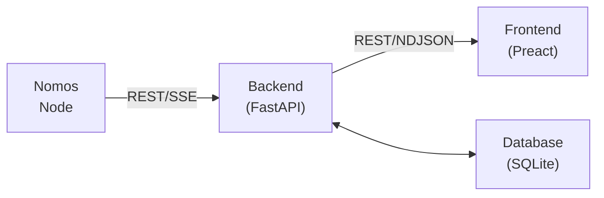

# Nomos Block Explorer

This is a Proof of Concept (PoC) for a block explorer for the Nomos blockchain.


## Features

- Frontend (React-like SPA)
  - Client-side routing with Home, Block, and Transaction pages.
    - Home: Live stream of the latest Blocks and Transactions.
    - Block: Details of a Block, including a list of its transactions.
    - Transaction: Details of a Transaction.
- Backend (Starlette)
  - API
    - REST API to query Blocks and Transactions.
    - NDJSON streams of live Blocks (and their transactions).
  - Node integration over the node's HTTP API, with a chain-walking backfill.
  - Simple backfilling mechanism to populate historical blocks.

## Architecture

The Nomos Block Explorer follows a three-tier architecture with a clear separation of concerns:

### High-Level Overview



### Components

#### 1. Frontend (`/static`)
- **Framework**: Preact (lightweight React alternative)
- **Routing**: Client-side SPA routing
- **Architecture**: Component-based with functional components
- **Communication**: REST API calls and NDJSON streams for real-time updates

#### 2. Backend (`/src`)
- **Framework**: Starlette on uvicorn; `app.py` holds the route table and lifespan
- **API Layer** (`/src/api`): API schemas, REST and streaming endpoints
- **Core** (`/src/core`): Settings, base types, the ingestion-to-stream notifier
- **Database** (`/src/db.py`): SQLite schema and every query, on the standard library's `sqlite3`
- **Models** (`/src/models`): Stored models (Block, Transaction, Header, etc.), plain pydantic
- **Node Integration** (`/src/node`): HTTP client for the node API, wire-format serializers, ingestion loop

#### 3. Data Flow

1. **Node Updates**: On startup, the backend starts listening for new blocks from the node and stores them in the database
2. **Backfilling**: After at least one block is in the database, the backend fetches historical blocks from the node and stores them
3. **Client Updates**: Frontend subscribes to the NDJSON streams for real-time block and transaction updates
4. **Data Access**: All queries live in `src/db.py`
5. **Canonical chain**: Every block event from the node carries the node's current tip; ingestion flags that tip's chain canonical (flipping the flags above the common ancestor on a reorg) and every read serves it

#### 4. Key Design Patterns

- **Adapter Pattern**: Serializers convert between Node API formats and the stored models
- **Observer Pattern**: Ingestion notifies open streams after each commit; streams cursor on the canonical sequence


## Requirements

- Python 3.14
- UV Package Manager

## How to run

1. Install the dependencies:
   ```bash
   uv sync
   ```

2. Run the block explorer:
   ```bash
   uv run python src/main.py
   ```
By default, this will try to connect to a local Node API on `127.0.0.1:8080`.

- You can optionally run it via Docker with:
    ```bash
    docker build -t nomos-block-explorer . && docker run -p 8000:8000 nomos-block-explorer
    ```

### Configuration

The block explorer is configured through environment variables. The following variables are available:
```dotenv
NBE_LOG_LEVEL=DEBUG  # DEBUG, INFO, WARNING, ERROR, CRITICAL

NBE_NODE_API_HOST=127.0.0.1  # Host, host/path, or a full URL such as https://example.org/node/1
NBE_NODE_API_PORT=8080  # Ignored when NBE_NODE_API_HOST is a full URL
NBE_NODE_API_PROTOCOL=http  # Ignored when NBE_NODE_API_HOST is a full URL
NBE_NODE_API_TIMEOUT=60
NBE_NODE_API_AUTH="Basic <base64 user:pass>"  # Optional

NBE_HOST=0.0.0.0  # Block Explorer's listening host
NBE_PORT=8000  # Block Explorer's listening port
NBE_BASE_PATH=  # Path prefix when served behind a reverse proxy, e.g. /explorer

NBE_DATABASE_PATH=sqlite.db  # SQLite database file (defaults to sqlite.db in the repository root)
```
A `.env` file in the repository root is loaded at startup; variables already set in the environment win.

If running the Block Explorer with Docker, these can be overridden.

## Considerations

This PoC makes simplifications to focus on the core features:
- Each slot has exactly one block.
- When backfilling, the block explorer will only backfill from the earliest block's slot to genesis.

## Ideas and improvements

- Fix aforementioned assumptions
- Backfilling
  - Make requests concurrently
  - Backfill all slots
  - Upsert received blocks and transactions
- Add tests
- Colour logs by level
- Reconnections
  - Failures to connect to Node
  - Timeouts
  - Stream closed
- Frontend
  - Add a block / transaction search barImprove
  - Make pages work with block/transaction hash, rather than the `id`
- Error handling
  - Exceptions raised within async code pop up as ugly stack traces
  - Better error messages
- Remove DB IDs from API responses and use hashes instead
